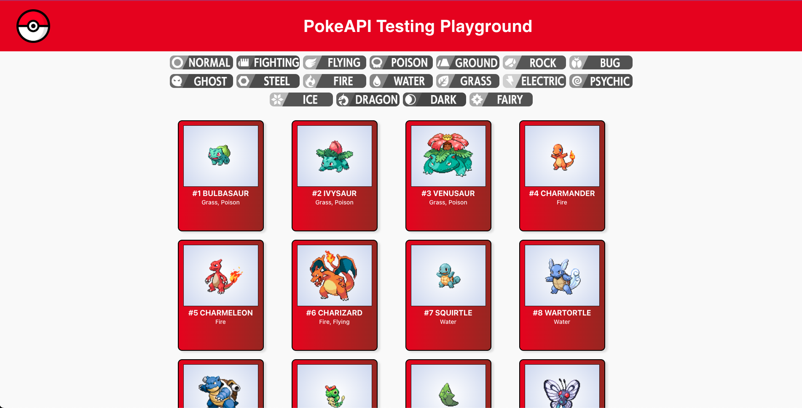
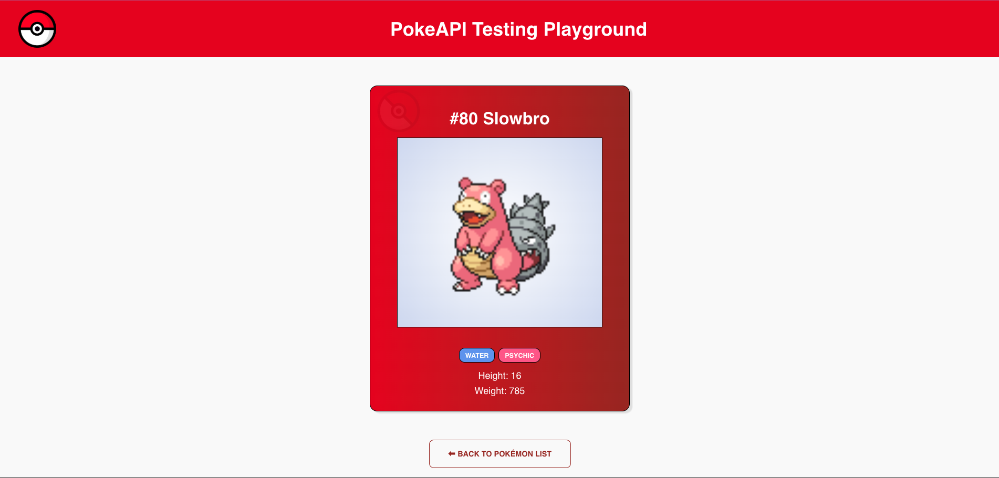

# PokeAPI Training Grounds for Test Automation

This project was bootstrapped with [Create React App](https://github.com/facebook/create-react-app).

As a way to create a safe environment to practice Test Automation and with the help from ChatGPT I built this site that uses the [PokeAPI](https://pokeapi.co/) to build 2 separate templates, a PLP page and a PDP page.

### The PLP Page has the following functionality:

- Display sets of 20 Pokemon Cards
- Allow the user to navigate forwards and backwards through the full list of Pokemon
- Allow the user to Filter by single type or multiple types (selecting multiple types will return pokemon belonging to either or type, it's not reducing the pool of results)

### The PDP Page has the following functionality:

- Display a single individual Pokemon in a similar style card
- Add a bit more information about the Pokemon (Height, Weight)
- Allow the user to navigate back to the PLP

### Playwright Tests:

I added a series of Playwright tests, they're running on GHA when the user creates a Pull Request to main and After a Push to Main. You can find the (currently 2) specs under:

`/tests`

## Pre-Requisites

- Have NodeJS installed
- Run `npm install` from the project's root to install the projects dependencies

## Available Scripts

In the project directory, you can run:

### `npm start`

Runs the app in the development mode.\
Open [http://localhost:3000](http://localhost:3000) to view it in your browser.

The page will reload when you make changes.\
You may also see any lint errors in the console.

### `npm test`

Launches the `Testing Library` test runner in the interactive watch mode.\
See the section about [running tests](https://facebook.github.io/create-react-app/docs/running-tests) for more information.

### `npx playwright test --reporter=list`

This will run the Playwright tests included with the Page. The reporter flag will make sure you get feedback on individual test execution.

### `npx playwright test --ui`

This will open the Playwright UI allowing you to debug or extend test coverage interactively.

### `npm run build`

Builds the app for production to the `build` folder.\
It correctly bundles React in production mode and optimizes the build for the best performance.

The build is minified and the filenames include the hashes.\
Your app is ready to be deployed!

See the section about [deployment](https://facebook.github.io/create-react-app/docs/deployment) for more information.
